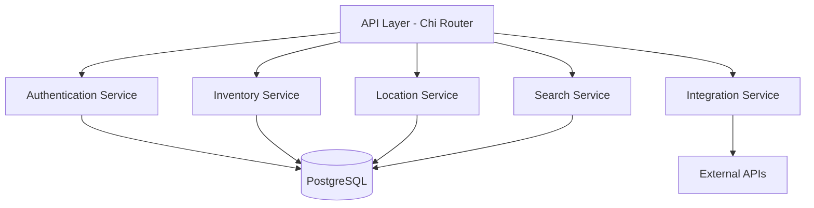

# Backend Architecture

```mermaid
flowchart TD
    API[API Layer - Chi Router] --> Auth[Authentication Service]
    API --> Inventory[Inventory Service]
    API --> Location[Location Service]
    API --> Search[Search Service]
    API --> Integration[Integration Service]

    Auth --> DB[(PostgreSQL)]
    Inventory --> DB
    Location --> DB
    Search --> DB
    Integration --> External[External APIs]
```
