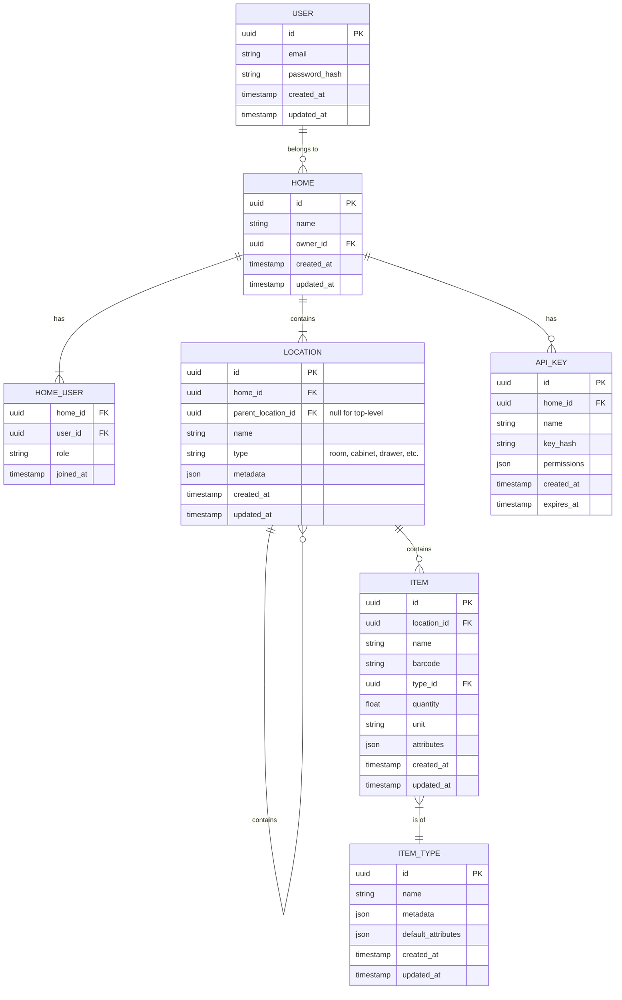

# Database ER Diagram

```mermaid
erDiagram
    USER ||--o{ HOME : "belongs to"
    HOME ||--|{ HOME_USER : "has"
    HOME ||--|{ LOCATION : "contains"
    LOCATION ||--o{ LOCATION : "contains"
    LOCATION ||--o{ ITEM : "contains"
    ITEM }|--|| ITEM_TYPE : "is of"
    HOME ||--o{ API_KEY : "has"

    USER {
        uuid id PK
        string email
        string password_hash
        timestamp created_at
        timestamp updated_at
    }

    HOME {
        uuid id PK
        string name
        uuid owner_id FK
        timestamp created_at
        timestamp updated_at
    }

    HOME_USER {
        uuid home_id FK
        uuid user_id FK
        string role
        timestamp joined_at
    }

    LOCATION {
        uuid id PK
        uuid home_id FK
        uuid parent_location_id FK "null for top-level"
        string name
        string type "room, cabinet, drawer, etc."
        json metadata
        timestamp created_at
        timestamp updated_at
    }

    ITEM {
        uuid id PK
        uuid location_id FK
        string name
        string barcode
        uuid type_id FK
        float quantity
        string unit
        json attributes
        timestamp created_at
        timestamp updated_at
    }

    ITEM_TYPE {
        uuid id PK
        string name
        json metadata
        json default_attributes
        timestamp created_at
        timestamp updated_at
    }

    API_KEY {
        uuid id PK
        uuid home_id FK
        string name
        string key_hash
        json permissions
        timestamp created_at
        timestamp expires_at
    }
```
