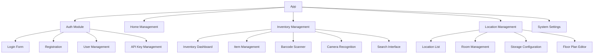

# Frontend Component Hierarchy

```mermaid
flowchart TD
    App --> Auth[Auth Module]
    App --> Home[Home Management]
    App --> Inventory[Inventory Management]
    App --> Location[Location Management]
    App --> Settings[System Settings]

    Auth --> Login[Login Form]
    Auth --> Register[Registration]
    Auth --> Users[User Management]
    Auth --> APIKeys[API Key Management]

    Inventory --> Dashboard[Inventory Dashboard]
    Inventory --> Items[Item Management]
    Inventory --> Scanner[Barcode Scanner]
    Inventory --> Camera[Camera Recognition]
    Inventory --> Search[Search Interface]

    Location --> Locations[Location List]
    Location --> Rooms[Room Management]
    Location --> Storage[Storage Configuration]
    Location --> FloorPlan[Floor Plan Editor]
```
