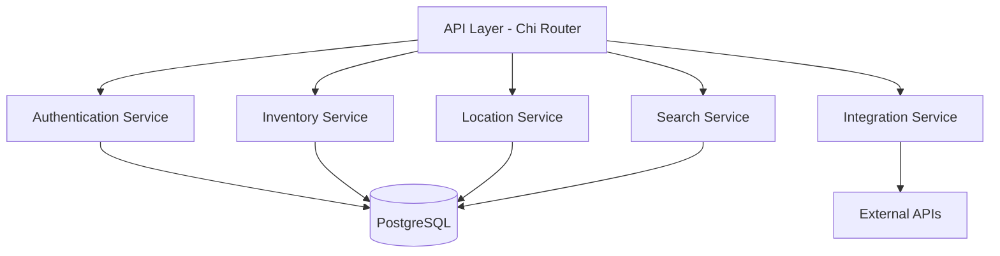

# Implementation Plan

This document provides a detailed breakdown of the project implementation phases, tasks, timelines, and technical specifications for the Mnemo home inventory tracking system.

## Project Timeline

| Phase | Description                    | Estimated Duration | Target Dates                |
| ----- | ------------------------------ | ------------------ | --------------------------- |
| 1     | Project Initialization & Setup | 1 week             | May 10-17, 2025             |
| 2     | Backend Core Development       | 5 weeks            | May 17-June 21, 2025        |
| 3     | Frontend Foundation            | 4 weeks            | May 17-June 14, 2025        |
| 4     | Integration & Testing          | 2 weeks            | June 21-July 5, 2025        |
| 5     | Advanced Features              | 5 weeks            | July 5-August 9, 2025       |
| 6     | Refinement & Finalization      | 5 weeks            | August 9-September 13, 2025 |

## Phase 1: Project Initialization & Setup

### 1.1 Project Structure Setup

- Create main repository with README, LICENSE, and .gitignore
- Set up directory structure for backend and frontend
- Initialize Go module for backend
- Set up package.json for frontend
- Configure linting and formatting tools
- Establish CI/CD pipeline

### 1.2 Development Environment

- Create Docker Compose file for development services
- Configure PostgreSQL container with initialization scripts
- Set up hot-reloading for Go backend (Air)
- Configure frontend development server
- Create documentation for development setup

## Phase 2: Backend Core Development

### 2.1 Database Schema Design

- Create migration files for:
  - Users table
  - Homes table
  - Home_users table
  - Locations table (with self-referential relationship)
  - Items table
  - Item_types table
  - API_keys table
- Implement database initialization and migration scripts
- Create backup and restoration procedures

### 2.2 Authentication System

- Implement user registration with email/password
- Create login system with JWT token generation
- Add middleware for authentication
- Develop role-based authorization system
- Implement home entity management
- Create user invitation flow
- Develop API key generation and validation

### 2.3 Core API Development

- Set up Chi router with middleware
- Implement RESTful endpoints:
  - User management API
  - Home management API
  - Location hierarchy API
  - Item management API
  - Search and filtering API
- Create services for business logic:
  - Auth service
  - Home service
  - Location service
  - Inventory service
  - Search service
- Implement validation for API inputs
- Add error handling and logging

## Phase 3: Frontend Foundation

### 3.1 Frontend Project Setup

- Initialize React project with TypeScript
- Configure Vite for build optimization
- Set up Shadcn UI components
- Establish PWA configuration
- Create responsive base layout
- Set up global state management
- Configure routing with React Router
- Implement authentication context

### 3.2 Authentication UI

- Create login page
- Build registration form
- Implement password reset flow
- Develop home management screens
- Create user invitation component
- Build user role management interface
- Design API key management UI

### 3.3 Core UI Components

- Develop navigation and layout components
- Create dashboard with summary statistics
- Build item management interfaces:
  - Item list view
  - Item detail view
  - Add/edit item forms
  - Quantity update component
- Implement location management UI:
  - Location hierarchy browser
  - Location editor
  - Item-to-location assignment
- Design search component with filters

## Phase 4: Integration & Testing

### 4.1 API Integration

- Connect frontend authentication to backend
- Integrate inventory management operations
- Implement location hierarchy navigation
- Set up real-time updates for inventory
- Create error handling and notifications
- Implement offline capabilities

### 4.2 Testing Strategy

- Write unit tests for backend services
- Create integration tests for API endpoints
- Implement frontend component tests
- Set up end-to-end testing for critical flows
- Perform database performance testing
- Test PWA functionality across devices

## Phase 5: Advanced Features

### 5.1 Barcode & Image Recognition

- Implement barcode scanning component
- Create camera access API integration
- Develop barcode processing logic
- Build data enrichment flows:
  - Google Books API integration
  - UPC database lookup
- Design ML model integration points

### 5.2 Location & Spatial Management

- Implement multi-location support
- Create floor plan visualization component
- Build visual storage configuration tool
- Develop location-based filtering
- Implement manifest generation from images
- Create location reports and statistics

## Phase 6: Refinement & Finalization

### 6.1 Performance Optimization

- Profile and optimize database queries
- Implement caching strategies:
  - Response caching
  - Database query caching
- Enhance frontend loading performance:
  - Code splitting
  - Asset optimization
- Improve mobile experience
- Optimize PWA for offline use

### 6.2 Security Hardening

- Perform security audit
- Implement encryption for sensitive data
- Enhance authentication security:
  - Rate limiting
  - CSRF protection
  - XSS prevention
- Set up comprehensive logging
- Conduct penetration testing

### 6.3 Documentation & Deployment

- Create user documentation
- Write API documentation
- Develop technical architecture documentation
- Create installation guide
- Build deployment instructions
- Establish backup and recovery procedures

## Technical Specifications

### Backend Architecture



### Database Schema Details

```sql
-- Users table
CREATE TABLE users (
    id UUID PRIMARY KEY DEFAULT gen_random_uuid(),
    email VARCHAR(255) NOT NULL UNIQUE,
    password_hash VARCHAR(255) NOT NULL,
    created_at TIMESTAMP WITH TIME ZONE DEFAULT NOW(),
    updated_at TIMESTAMP WITH TIME ZONE DEFAULT NOW()
);

-- Homes table
CREATE TABLE homes (
    id UUID PRIMARY KEY DEFAULT gen_random_uuid(),
    name VARCHAR(255) NOT NULL,
    owner_id UUID NOT NULL REFERENCES users(id),
    created_at TIMESTAMP WITH TIME ZONE DEFAULT NOW(),
    updated_at TIMESTAMP WITH TIME ZONE DEFAULT NOW()
);

-- Home users table
CREATE TABLE home_users (
    home_id UUID REFERENCES homes(id),
    user_id UUID REFERENCES users(id),
    role VARCHAR(50) NOT NULL,
    joined_at TIMESTAMP WITH TIME ZONE DEFAULT NOW(),
    PRIMARY KEY (home_id, user_id)
);

-- Locations table (self-referential)
CREATE TABLE locations (
    id UUID PRIMARY KEY DEFAULT gen_random_uuid(),
    home_id UUID NOT NULL REFERENCES homes(id),
    parent_location_id UUID REFERENCES locations(id),
    name VARCHAR(255) NOT NULL,
    type VARCHAR(100) NOT NULL,
    metadata JSONB DEFAULT '{}',
    created_at TIMESTAMP WITH TIME ZONE DEFAULT NOW(),
    updated_at TIMESTAMP WITH TIME ZONE DEFAULT NOW()
);

-- Item types table
CREATE TABLE item_types (
    id UUID PRIMARY KEY DEFAULT gen_random_uuid(),
    name VARCHAR(255) NOT NULL,
    metadata JSONB DEFAULT '{}',
    default_attributes JSONB DEFAULT '{}',
    created_at TIMESTAMP WITH TIME ZONE DEFAULT NOW(),
    updated_at TIMESTAMP WITH TIME ZONE DEFAULT NOW()
);

-- Items table
CREATE TABLE items (
    id UUID PRIMARY KEY DEFAULT gen_random_uuid(),
    location_id UUID REFERENCES locations(id),
    name VARCHAR(255) NOT NULL,
    barcode VARCHAR(255),
    type_id UUID REFERENCES item_types(id),
    quantity FLOAT NOT NULL DEFAULT 1,
    unit VARCHAR(50),
    attributes JSONB DEFAULT '{}',
    created_at TIMESTAMP WITH TIME ZONE DEFAULT NOW(),
    updated_at TIMESTAMP WITH TIME ZONE DEFAULT NOW()
);

-- API keys table
CREATE TABLE api_keys (
    id UUID PRIMARY KEY DEFAULT gen_random_uuid(),
    home_id UUID NOT NULL REFERENCES homes(id),
    name VARCHAR(255) NOT NULL,
    key_hash VARCHAR(255) NOT NULL,
    permissions JSONB NOT NULL DEFAULT '{}',
    created_at TIMESTAMP WITH TIME ZONE DEFAULT NOW(),
    expires_at TIMESTAMP WITH TIME ZONE
);

-- Indexes
CREATE INDEX ON locations(home_id);
CREATE INDEX ON locations(parent_location_id);
CREATE INDEX ON items(location_id);
CREATE INDEX ON items(type_id);
CREATE INDEX ON items(barcode);
CREATE INDEX ON home_users(user_id);
CREATE INDEX ON api_keys(home_id);
```

### API Endpoints Structure

```
/api/v1
  /auth
    POST /register
    POST /login
    POST /refresh
    POST /forgot-password
    POST /reset-password
    GET /me

  /homes
    GET /
    POST /
    GET /:id
    PUT /:id
    DELETE /:id
    POST /:id/invite
    GET /:id/users
    PUT /:id/users/:userId
    DELETE /:id/users/:userId

  /locations
    GET /
    POST /
    GET /:id
    PUT /:id
    DELETE /:id
    GET /:id/items
    GET /:id/children
    GET /:id/path

  /items
    GET /
    POST /
    GET /:id
    PUT /:id
    DELETE /:id
    PUT /:id/quantity

  /item-types
    GET /
    POST /
    GET /:id
    PUT /:id
    DELETE /:id

  /search
    GET /items
    GET /locations

  /api-keys
    GET /
    POST /
    DELETE /:id
```

### Frontend Component Hierarchy

```
App
├── AuthContext
├── Layout
│   ├── Header
│   ├── Sidebar
│   └── MainContent
├── Pages
│   ├── Auth
│   │   ├── Login
│   │   ├── Register
│   │   └── PasswordReset
│   ├── Dashboard
│   ├── Inventory
│   │   ├── ItemList
│   │   ├── ItemDetail
│   │   ├── AddEditItem
│   │   └── BarcodeScanner
│   ├── Locations
│   │   ├── LocationTree
│   │   ├── LocationDetail
│   │   ├── LocationEditor
│   │   └── FloorPlan
│   ├── Settings
│   │   ├── Profile
│   │   ├── HomeSettings
│   │   ├── UserManagement
│   │   └── ApiKeys
│   └── Search
└── Components
    ├── Common
    │   ├── Button
    │   ├── Input
    │   ├── Select
    │   ├── Modal
    │   └── Card
    ├── Inventory
    │   ├── ItemCard
    │   ├── QuantityEditor
    │   └── ItemAttributes
    └── Locations
        ├── LocationBrowser
        ├── LocationBreadcrumb
        └── StorageViewer
```

## Development Practices

- **Version Control**: Git with feature branches and pull request reviews
- **Code Style**: Enforce consistent formatting with linters and formatters
- **Testing**: Aim for 80%+ test coverage for backend services
- **Documentation**: Maintain updated API documentation and usage examples
- **Deployment**: Docker containers for both development and production
- **Monitoring**: Implement logging and monitoring from the beginning
- **Memory Bank Updates**: Regular updates to memory bank documents after significant milestones

## Risk Mitigation

| Risk                                   | Mitigation Strategy                                              |
| -------------------------------------- | ---------------------------------------------------------------- |
| Complex location hierarchy performance | Implement materialized paths or recursive CTE optimization       |
| Mobile camera integration challenges   | Create progressive enhancement with fallbacks to manual entry    |
| Offline functionality issues           | Implement robust sync mechanism with conflict resolution         |
| Security vulnerabilities               | Regular security audits and adherence to OWASP guidelines        |
| Data loss concerns                     | Implement automatic and manual backup procedures with encryption |

This implementation plan serves as a roadmap for the development of the Mnemo home inventory system. It will be updated as the project progresses and new insights are gained.
